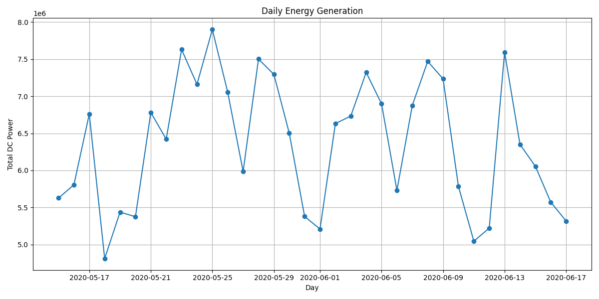

# Solar Energy Analysis Project

## 📌 Overview
This project is a Python-based software application for analyzing solar energy
production data. The program processes raw time-series data from solar sensors,
cleans the data, aggregates energy values on a daily basis, and visualizes the
results using line charts.

The main goal of this project is to practice Python programming and basic
software engineering concepts such as modular design and data processing.

---

## 🛠 Tech Stack
- Python 3
- Pandas
- Matplotlib

## Project Stracture

Solar-energy-project/
|
|-data/
|   |-raw/
|       |-Plant_1_Genetarion_Data.csv
|-notebooks/
|   |-exploratin.ipynd
|-src/
|   |---init--.py
|   |-analysis.py
|   |-data_cleaning.py
|   |-data_loader.py
|   |-visualization.py
|-main.py
|-README.md

## Program Flow
1. Load solar energy data from a CSV file  
2. Clean the data by removing missing values  
3. Convert timestamps and aggregate energy per day  
4. Visualize daily energy production as a line chart 

## output
1. A line chart showing daily solar energy production
2. Cleaned and aggregated daily energy data
 

## Project 2 ##

Solar Energy Analysis & Prediction Project

## 📌 Overview
This project analyzes solar energy generation data and evaluates energy performance using Python.
The goal is to simulate a real-world energy data workflow including data cleaning, analysis, anomaly detection, and prediction evaluation.

This project demonstrates skills in data processing, visuallization, and software engineering structure.

## 📌 Objective
- Process raw solar energy generation data
- Analyze daily energy production treds
- Detect abnormal energy  generation patterns
- Compare predicted vs actual energy generation
- Visualize results using professional graphs

## 📌 Technologies Used
- Python
- Pandas
- Matplotlib
- NumPy
- Scikit-learn (for metrics)

## 📌 Project Structure

Solar-energy-project/
|
|-data/
|   |-raw/
|       |-Plant_1_Genetarion_Data.csv
|-notebooks/
|   |-exploratin.ipynd
|-src/
|   |---init--.py
|   |-analysis.py
|   |-data_cleaning.py
|   |-data_loader.py
|   |-visualization.py
|-main.py
|-README.md

## Workflow
1. Data Loading
Loads raw solar generation dataset.
2. Data Cleaning
- Removes invalid values
- Convert data types
- Handles missing types
3. Data Analysis
- Calculates daily energy production
- Detects below-average energy days
- Performs anomaly dection
4. Prediction Evaluation
Compares predicted vs actual energy generation

## Example Output
- Daily Energy Generation
- Anomaly Detection
- Prediction vs Actual

## Performance Metrics
The project evaluates model performance using:
 - MAE (Mean Absolute Error)
 - RMSE (Root Mean Square Error)

