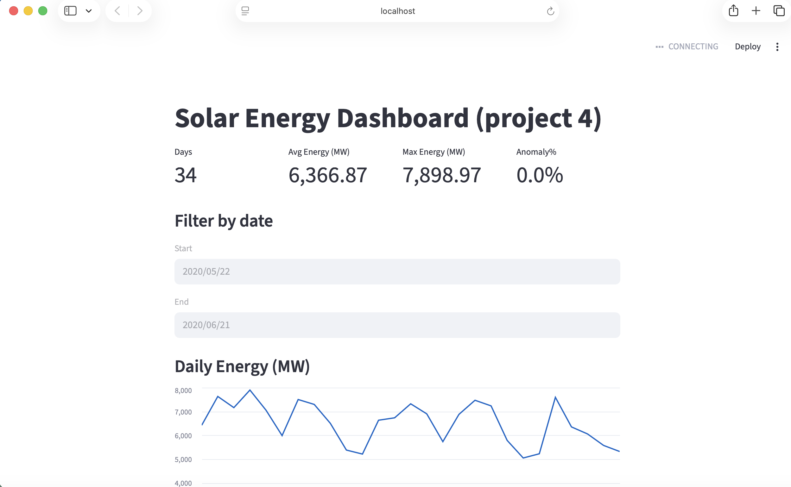

# Solar Energy Analysis Project

## 📌 Overview
This project is a Python-based software application for analyzing solar energy
production data. The program processes raw time-series data from solar sensors,
cleans the data, aggregates energy values on a daily basis, and visualizes the
results using line charts.

The main goal of this project is to practice Python programming and basic
software engineering concepts such as modular design and data processing.

---

## 🛠 Tech Stack
- Python 3
- Pandas
- Matplotlib

## Project Stracture

Solar-energy-project/
|
|-data/
|   |-raw/
|       |-Plant_1_Genetarion_Data.csv
|-notebooks/
|   |-exploratin.ipynd
|-src/
|   |---init--.py
|   |-analysis.py
|   |-data_cleaning.py
|   |-data_loader.py
|   |-visualization.py
|-main.py
|-README.md

## Program Flow
1. Load solar energy data from a CSV file  
2. Clean the data by removing missing values  
3. Convert timestamps and aggregate energy per day  
4. Visualize daily energy production as a line chart 

## output
1. A line chart showing daily solar energy production
2. Cleaned and aggregated daily energy data
 


## Project 2 ##

Solar Energy Analysis & Prediction Project

## 📌 Overview
This project analyzes solar energy generation data and evaluates energy performance using Python.
The goal is to simulate a real-world energy data workflow including data cleaning, analysis, anomaly detection, and prediction evaluation.

This project demonstrates skills in data processing, visuallization, and software engineering structure.

## 📌 Objective
- Process raw solar energy generation data
- Analyze daily energy production treds
- Detect abnormal energy  generation patterns
- Compare predicted vs actual energy generation
- Visualize results using professional graphs

## 📌 Technologies Used
- Python
- Pandas
- Matplotlib
- NumPy
- Scikit-learn (for metrics)

## 📌 Project Structure 
## Workflow
1. Data Loading
Loads raw solar generation dataset.
2. Data Cleaning
- Removes invalid values
- Convert data types
- Handles missing types
3. Data Analysis
- Calculates daily energy production
- Detects below-average energy days
- Performs anomaly dection
4. Prediction Evaluation
Compares predicted vs actual energy generation

## Example Output
- Daily Energy Generation
- Anomaly Detection
- Prediction vs Actual

## Performance Metrics
The project evaluates model performance using:
 - MAE (Mean Absolute Error)
 - RMSE (Root Mean Square Error)


## Project 3 ## Solar Energy Monitoring System 

## 🚀 Project Overview
This Project:
- Loads solar generation data from CSV
- Stores cleaned data in SQLite
- Exposes REST API endpoints via FastAPI
- Provides interactive dashboard via Streamlit
- Detects anomaly days in energy production

## Architecture
CSV -> Data Cleining -> SQLite -> FastAPI -> Streamlit Dasboard

## Tech Stack
- Python 3.9+
- FastAPI
- SQlite
- Pandas
- Streamlit
- Plotly (for interactive charts)
## API Endpoints
## 1. Get daily energy
    ```json
        [
            {
                "day": "2020-05-15",
                "energy": 5627239.14,
                "is_anomaly": false
            }
        ]
## 2. Energy Metrics
    Return:
        ```json
        {
            "day": 34,
            "avg_energgy": 5678123.45,
            "min_energy": 5208696.38,
            "max_energy": 7898965.11,
            "total_energy": 192345678.23,
            "anomaly_days": 2,
            "anomaly_pct: 5.88
        }
## 3. Anomaly Days
        ```GET/energy/anomalies

## Setup Instructions
1. Clone repo
    ```bash
        git clone <your-repo-url>
        cd Solar-energy-project
2. Install dependencies
    ```bash
        pip install -r requirements.txt
    or namually:
        pip install fastapi uvicorn streamlit pandas plotly
3. Populate database
    ```bash
        python3 scripts/populate_db.py
4. Run FasAPI backend
    ```bash
        python3 -m uvicorn backend.api:app --relode --port 8002
    Open:
        http://127.0.0.1:8002/docs
5. Run Streamlit Dashboard
    ```bash
        python3 -m streamlit run dashboard/app.py
    Open:
        http://localhost:8501
    ```

## Features
 - Data range filtering
 - KPI metrics (avg, max, total, anomaly%)
 - Interactive energy trend chart
 - Anomaly highlighting
 - Clean modular backend structure

 ## Project Structure
 ```
 Solar-energy-project/
 |__backend/
 |  |__api.py
 |  |__bd.py
 |  |__energy.db
 |
 |__scripts/
 |  |__populate_db.py
 |
 |__dashboard/
 |  |__app.py
 |__data/
 |  |__raw/
 |
 |__requirements.txt
 |__README.md
```
 ## Learning Outcomes
- REST API development with FastAPI
- SQL querying & ETL aggregation
- Data cleaning & ETL pipeline
- Full-Stack data app architecture
- Interactive dashboard development

## Future Improvments
- Dockerize application
- Deploy to cloud(Render/Railway)
- Add authentication
- Improve anomaly detection logic
- add rolling average & forecasting

## Project 4 Production - ready Backend
# Solar energy Monitoring System

A production-style backend for monitoring and analyzing solar generation data.
This Project builds on previous data analysis work and evolves into a structured software engineering system including:
    - Data ingestion
    - Database storage
    - REST API
    - Dashboard visualization
    - Automated testing
    - CI pipelline
# System Achitecture
Data Flow:

CSV Data
-> ETL Script
-> SQLite Database
-> FastAPI Backend
-> Streamlit Dashboard
-> GitHub Actions (CI Testing)

## Features
### Backend (FastAPI)
    -`/health` -  API health check
    -`/energy/daily`- Daily Energy data (supports start & query parmas)
    -`/energy/anomalies`- Filtered anomaly days
    -`/energy/metrics`- Aggregated statistics

### Database
    - SQLite
    - Daily aggregated
    - Anomaly flag storage
    - Configurable DB path via `-env`
### Dashborad (Streamlit)
    - Data range filtering
    - Energy displayed in MW
    - Line chart visualization
    - Anomaly table
### Devops / Quality
    - Pytest unit tests
    - Ruff (lining)
    - Black (formating)
    - GitHub action CI

## Setup

1. Create virtual enviroment
```bash
    python3 -m venv .venv
    source .venv/bin/activate
```
2. Install dependencis
```bash
    pip install -r requirements.txt
    pip install -r requirements-dev.txt
```
3. Initialize Database 
```bash
    python backend/db.py
```
4. Populate database
```bash
    python scripts/populate_db.py
```
5. Run API
```bash
    pythin -m uvicorn backend.api:app --reload --port 8002
```
6. Run Dahboard
```bash
    streamlit run dashboard/app.py
```
## Runtest
```bash
    pytest
```

## CI Pipline
GitHub actions automatically:
 . Installs dependencies
 . Runs tests
 . Validates code on every push

## Dashborad Output


## Solar Energy Monitoring System
# Overview
This project implements a solar energy monitoring system designed to process, analyze, and visualize photovoltaic power generation data.

The system processes raw CSV datasets, stores aggregated results in a SLQLite database, exposes the data through a REST API, and visualizes the information using an interactive dasboard.

The project evolved gradually from simple data analysis scripts into a modular backend system that follows software engineering principles such as layered architecture, testing, CI pipelines, and containerization.

# Objectives

The main goal of this project is to design a modular system capable of analyzing solar energy production and detecting anomalies.
 
 The system aims to:
 - Process raw photovoltaic production datasets
 - Store aggregated energy data in a database
 - Provide access to data through a REST API
 - Visualize energy production through a dashboard
 - Implement multiple anomaly detection methods
 - Appy sofware engineering best practices (testing, CI, containerization)

# System Architecture
The system follows a layered architecture to separate responsibilities and maintain clean code organization.

Raw CSV Data
     │
     ▼
Data Processing (Python + Pandas)
     │
     ▼
SQLite Database
     │
     ▼
Repository Layer
     │
     ▼
Service Layer (Business Logic)
     │
     ▼
FastAPI Backend
     │
     ▼
REST API
     │
     ▼
Streamlit Dashboard
     │
     ▼
User

# Project Struture
Solar-energy-project
│
├── backend
│   ├── api
│   ├── services
│   ├── repositories
│   ├── anomaly
│   ├── models
│   ├── core
│   ├── db
│   └── main.py
│
├── dashboard
│   └── app.py
│
├── scripts
│   └── populate_db.py
│
├── data
│   └── raw
│
├── tests
│
├── Dockerfile
├── Dockerfile.dashboard
├── docker-compose.yml
├── requirements.txt
└── README.md

## Technology Stack
# Programming Languages
- python
- SQL
- YAML
- Dockerfile syntax
- Markdown

## Libraries
# Data Processing
- pandas
- numpy
Used for:
- reading CSV datasets
- cleaning aand transforming data
- daily aggregation of energy production

## Database
- sqlite3
Used to sore processed energy data.
## Backend API
- FastAPI
- Pydantic
- Uvicorn
FastAPI is used to build the REST API and handle HTTP requests.
## Dashboard
- Streamlit
- requests
- pandas
The dashboard displays energy metrics, charts, and anomaly detection results.
## Testing
- pytest
- fastapi.testclient
Used for automated testing of API endpoints and anomaly detection logic.
## Code Quality
- Black
- Ruff 
Used for code formatting and linting

## Main Features
# Energy Data Processing
- CSV data ingestion
- Data cleaning and transformation
- Daily energy aggregation

## Anomaly Detection
Two anomaly detection methods are implemented:
    - Threshold-based detection
    - Z-score detection
Users can select the method theough the dashboard interface.

## REST API
The backend provides several API endpoints:

/health
/energy/daily
/energy/metrics
/energy/anomalies

The API returns JSON responses containing energy production statistics and anomaly detection results.

## Interactives Dashboard
The Streamlit dashboard provides:
- Daily energy visualization
- Summary statistics
- Anomaly detection results
- Date range filtering
- Selection of anomaly detection method

## Docker Deployment
The entire system can be launched using Docker.
Run the following command:
````
    docker compose up --build
````
After starting the containers, the following services will be available:
API documentation:
````
    http://localhost:8002/docs
````
Dashboard interface:
````
    http://localhost:8501
````

## Testing
Automated tests are implemented using pytest.

Run the tests using:
````
    pytest
````
The tests validate
- API endpoints
- anomaly dection algorithms

## Continuous Integration
