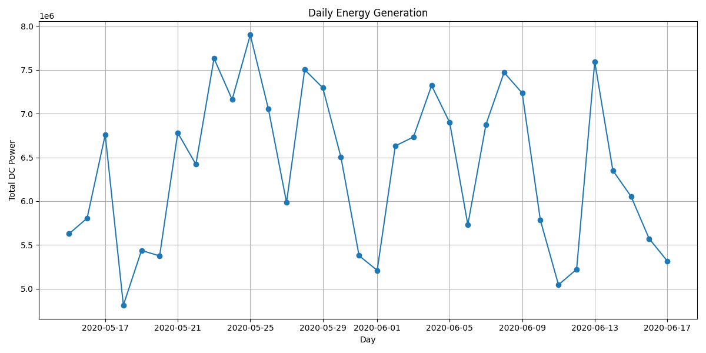

# Solar Energy Analysis Project

## 📌 Overview
This project is a Python-based software application for analyzing solar energy
production data. The program processes raw time-series data from solar sensors,
cleans the data, aggregates energy values on a daily basis, and visualizes the
results using line charts.

The main goal of this project is to practice Python programming and basic
software engineering concepts such as modular design and data processing.

---

## 🛠 Tech Stack
- Python 3
- Pandas
- Matplotlib

## Project Stracture

Solar-energy-project/
|
|-data/
|   |-raw/
|       |-Plant_1_Genetarion_Data.csv
|-notebooks/
|   |-exploratin.ipynd
|-src/
|   |---init--.py
|   |-analysis.py
|   |-data_cleaning.py
|   |-data_loader.py
|   |-visualization.py
|-main.py
|-README.md

## Program Flow
1. Load solar energy data from a CSV file  
2. Clean the data by removing missing values  
3. Convert timestamps and aggregate energy per day  
4. Visualize daily energy production as a line chart 

## output
1. A line chart showing daily solar energy production
2. Cleaned and aggregated daily energy data
 


## Project 2 ##

Solar Energy Analysis & Prediction Project

## 📌 Overview
This project analyzes solar energy generation data and evaluates energy performance using Python.
The goal is to simulate a real-world energy data workflow including data cleaning, analysis, anomaly detection, and prediction evaluation.

This project demonstrates skills in data processing, visuallization, and software engineering structure.

## 📌 Objective
- Process raw solar energy generation data
- Analyze daily energy production treds
- Detect abnormal energy  generation patterns
- Compare predicted vs actual energy generation
- Visualize results using professional graphs

## 📌 Technologies Used
- Python
- Pandas
- Matplotlib
- NumPy
- Scikit-learn (for metrics)

## 📌 Project Structure

Solar-energy-project/
|
|-data/
|   |-raw/
|       |-Plant_1_Genetarion_Data.csv
|-notebooks/
|   |-exploratin.ipynd
|-src/
|   |---init--.py
|   |-analysis.py
|   |-data_cleaning.py
|   |-data_loader.py
|   |-visualization.py
|-main.py
|-README.md

## Workflow
1. Data Loading
Loads raw solar generation dataset.
2. Data Cleaning
- Removes invalid values
- Convert data types
- Handles missing types
3. Data Analysis
- Calculates daily energy production
- Detects below-average energy days
- Performs anomaly dection
4. Prediction Evaluation
Compares predicted vs actual energy generation

## Example Output
- Daily Energy Generation
- Anomaly Detection
- Prediction vs Actual

## Performance Metrics
The project evaluates model performance using:
 - MAE (Mean Absolute Error)
 - RMSE (Root Mean Square Error)


## Project 3 ##
Final Check - Solar Energy Monitoring System 

# Project Structire
() src/
() backend/
() dashboard/
() data/
() output/
# Depandencies
() 'requirements.tet incould packet: pandas, matplotlib, numpy, streamlit, requests,  fastapi, uvicorn
() instellamd run: pip install -r requirements.txt
# Data Pipeline (projrct 1+2 Logic)
() load CSV
() clean data (NaN/Data type)
() aggregate daily (data --> Day)
() anamaly detection (threshold_ratio)
() forecasting baseline (rolling mean)
() metrics: avg/min/max/total/anomaly_count
# Database (SQL-SQLite)
() .backend/energy.db
() daily_energy table (colume:day, energy, is_anomaly)
() script populate DB (input daily to DB)
# API (FastAPI)
() run uvicorrn backend.api:app --reload
() open docs: http://127.0.0.1:8000/docs
() Endpoint work:
    () GET /energy/daily
    () GET /energy/anomalies
    () GET /energy/metrics
# Dashboard (Streamlit UI)
() run streamlis run dashboard/app.py
() Retrieving data from API.
() show grah 'daily energy'
() show anomaly days
() show metrics 
() adjust threshold in UI and anomaly chenge (pass API calculate)
# Documenttation (README)
() explain Project 1 + 2 + 3 
() how to run : pipeline/populate DB, API, Dashbord
() picture and screenshot UI in README
# GitHub
() Commit
() Push to GitHub
() can README show a picture

#☀️Solar Energy Analysis Dashboard

Full-stack data projrct using **FAstAPI + SQLite + Streamlit**
Analyze daily solar energy generation and detect anomalies

## 🚀 Project Overview
This Project:
- Loads solar generation data from CSV
- Stores cleaned data in SQLite
- Exposes REST API endpoints via FastAPI
- Provides interactive dashboard via Streamlit
- Detects anomaly days in energy production

## Architecture
CSV -> Data Cleining -> SQLite -> FastAPI -> Streamlit Dasboard

## Tech Stack
- Python 3.9+
- FastAPI
- SQlite
- Pandas
- Streamlit
- Plotly (for interactive charts)
## API Endpoints
## 1. Get daily energy
    ```json
        [
            {
                "day": "2020-05-15",
                "energy": 5627239.14,
                "is_anomaly": false
            }
        ]
## 2. Energy Metrics
    Return:
        ```json
        {
            "day": 34,
            "avg_energgy": 5678123.45,
            "min_energy": 5208696.38,
            "max_energy": 7898965.11,
            "total_energy": 192345678.23,
            "anomaly_days": 2,
            "anomaly_pct: 5.88
        }
## 3. Anomaly Days
        ```GET/energy/anomalies

## Setup Instructions
1. Clone repo
    ```bash
        git clone <your-repo-url>
        cd Solar-energy-project
2. Install dependencies
    ```bash
        pip install -r requirements.txt
    or namually:
        pip install fastapi uvicorn streamlit pandas plotly
3. Populate database
    ```bash
        python3 scripts/populate_db.py
4. Run FasAPI backend
    ```bash
        python3 -m uvicorn backend.api:app --relode --port 8002
    Open:
        http://127.0.0.1:8002/docs
5. Run Streamlit Dashboard
    ```bash
        python3 -m streamlit run dashboard/app.py
    Open:
        http://localhost:8501

## Features
 - Data range filtering
 - KPI metrics (avg, max, total, anomaly%)
 - Interactive energy trend chart
 - Anomaly highlighting
 - Clean modular backend structure

 ## Project Structure
 
 Solar-energy-project/
 |__backend/
 |  |__api.py
 |  |__bd.py
 |  |__energy.db
 |
 |__scripts/
 |  |__populate_db.py
 |
 |__dashboard/
 |  |__app.py
 |__data/
 |  |__raw/
 |
 |__requirements.txt
 |__README.md

 ## Learning Outcomes
- REST API development with FastAPI
- SQL querying & ETL aggregation
- Data cleaning & ETL pipeline
- Full-Stack data app architecture
- Interactive dashboard development

## Future Improvments
- Dockerize application
- Deploy to cloud(Render/Railway)
- Add authentication
- Improve anomaly detection logic
- add rolling average & forecasting
 
